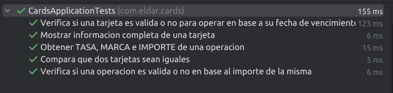

# CARDS 

### Test Unitarios (Ejercicio 1)

```
 mvn test

```


### Ejecución del servicio

```
 mvn spring-boot:run

```
### Ejecución en Docker

```
 // Para generar la imagen
 
 docker build -t cards .
 
 // Para ejecutar dicha imagen en un contenedor
 
 docker run -p 8080:8080 cards

```